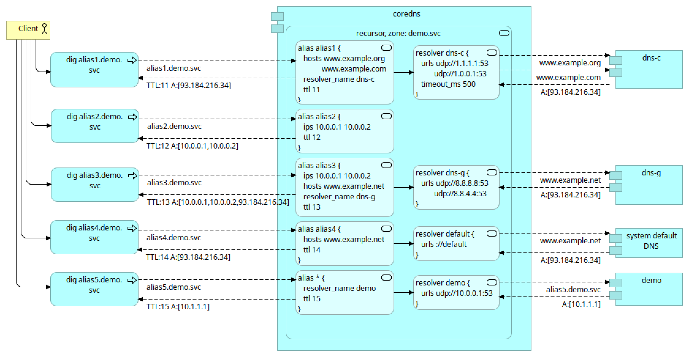

## Coredns BOSH Release

Bosh release of [CoreDNS](https://coredns.io/) with [recursor plugin](https://github.com/kinjelom/coredns-recursor)

The CoreDNS process is managed by BPM to ensure better lifecycle handling, stability, and upgrade reliability. 
To enable this, the release includes a BPM job that should be referenced in the deployment manifests.

A dedicated control zone is used to verify that the DNS server has successfully loaded the latest configuration.
During template rendering, a serial number is generated based on the current date and time. 
In the `post-start` script, this serial is queried from the DNS server and compared with the expected value. 
This mechanism ensures that the new configuration is active.

You can disable this verification using the following property: `coredns.config.verify_control_serial_post_start: false`

A run-errand named `check-coredns` is provided and can be executed at any time to verify 
that the DNS server returns the expected serial number stored in the rendered configuration. 

### Use Case



### Deployment
```yaml
---
name: ((deployment_name))

instance_groups:
- name: coredns
  azs: [z1, z2, z3]
  instances: 1
  vm_type: default
  stemcell: default
  networks: [name: default]
  jobs:
  - name: coredns
    release: coredns
  - name: bpm
    release: bpm

releases:
- name: coredns
  version: latest
- name: bpm
  version: latest

stemcells:
- alias: default
  os: ubuntu-jammy
  version: latest

update:
  canaries: 1
  canary_watch_time: 30000-1200000
  max_in_flight: 1
  serial: false
  update_watch_time: 5000-1200000

```

```yaml
---
- type: replace
  path: /instance_groups/name=coredns/jobs/name=coredns/properties?/coredns?/config?/main?/blocks?/-
  value: |+
    demo.svc. {
      recursor {
        external-yaml /var/vcap/jobs/coredns/config/external/demo.svc.yaml
        verbose 1
      }
      log
      errors
    }

- type: replace
  path: /instance_groups/name=coredns/jobs/name=coredns/properties?/coredns?/config?/external?/files?/-
  value:
    name: demo.svc.yaml
    yaml:
      resolvers:
        dns-c:
          urls: [ udp://1.1.1.1:53, udp://1.0.0.1:53 ]
          timeout_ms: 500
        dns-g:
          urls: [ udp://8.8.8.8:53, udp://8.8.4.4:53 ]
        demo:
          urls: [ udp://10.0.0.1:53 ]
      aliases:
        alias1:
          hosts: [ www.example.org, www.example.com ]
          resolver_name: dns-c
          ttl: 11
        alias2:
          ips: [ 10.0.0.1, 10.0.0.2 ]
          ttl: 12
        alias3:
          ips: [ 10.0.0.1, 10.0.0.2 ]
          hosts: [ www.example.net ]
          resolver_name: dns-g
          ttl: 13
        alias4:
          hosts: [ www.example.net ]
          ttl: 14
        "*":
          resolver_name: demo
          ttl: 15
```
