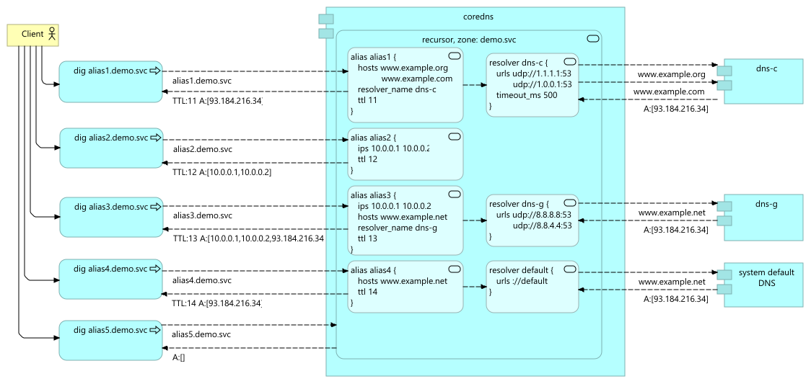

## Coredns BOSH Release

Bosh release of [CoreDNS](https://coredns.io/) with [recursor plugin](https://github.com/kinjelom/coredns-recursor)

### Use Case



### Deployment
```yaml
---
name: ((deployment_name))

instance_groups:
- name: coredns
  azs: [z1, z2, z3]
  instances: 1
  vm_type: default
  stemcell: default
  networks: [name: default]
  jobs:
  - name: coredns
    release: coredns

releases:
- name: coredns
  version: latest

stemcells:
- alias: default
  os: ubuntu-jammy
  version: latest

update:
  canaries: 1
  canary_watch_time: 30000-1200000
  max_in_flight: 1
  serial: false
  update_watch_time: 5000-1200000

```

```yaml
---
- type: replace
  path: /instance_groups/name=coredns/jobs/name=coredns/properties?/coredns?/config?/main?/blocks?/-
  value: |+
    demo.svc. {
      recursor {
        external-yaml /var/vcap/jobs/coredns/conf/external/demo.svc.yaml
        verbose 1
      }
      log
      errors
    }

- type: replace
  path: /instance_groups/name=coredns/jobs/name=coredns/properties?/coredns?/config?/external?/files?/-
  value:
    name: demo.svc.yaml
    yaml:
        zone: demo.svc
        resolvers:
          dns-c:
            urls: [ udp://1.1.1.1:53, udp://1.0.0.1:53 ]
            timeout_ms: 500
          dns-g:
            urls: [ udp://8.8.8.8:53, udp://8.8.4.4:53 ]
        aliases:
          alias1:
            hosts: [ www.example.org, www.example.com ]
            resolver_name: dns-c
            ttl: 11
          alias2:
            ips: [ 10.0.0.1, 10.0.0.2 ]
            ttl: 12
          alias3:
            ips: [ 10.0.0.1, 10.0.0.2 ]
            hosts: [ www.example.net ]
            resolver_name: dns-g
            ttl: 13
          alias4:
            hosts: [ www.example.net ]
            ttl: 14
```


### Installation

You can reference this release in your deployment manifest from the `releases` section:
```yaml
- name: "coredns"
  version: "1.0.0"
  url: "https://github.com/kinjelom/coredns-boshrelease/releases/download/v1.0.0/coredns-boshrelease-1.0.0.tgz"
  sha1: "4f700866c95eeeb86c120fce2837f5cbd60056a8"
```
Or upload it to your director with the `upload-release` command:
```
bosh upload-release --sha1 4f700866c95eeeb86c120fce2837f5cbd60056a8 \
  https://github.com/kinjelom/coredns-boshrelease/releases/download/v1.0.0/coredns-boshrelease-1.0.0.tgz
```

[All versions](versions.md)
